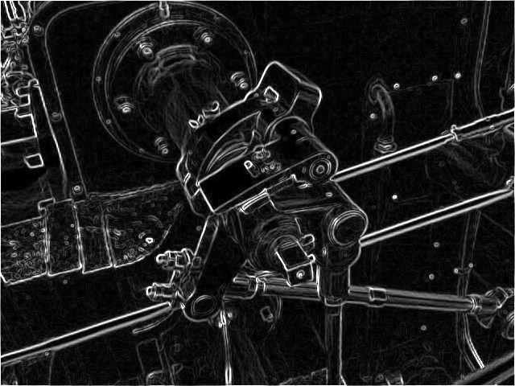
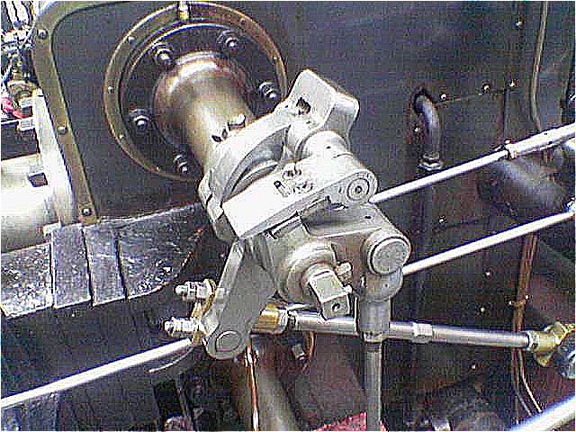
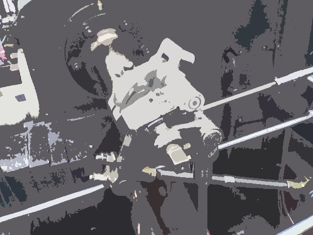

Input image:

Outputs:

 
 
 

Pe langa structurile predefinite in bmp_header.h, am definit mai multe
structuri, cu rolul de a organiza mai bine componentele unei imagini si a
face procesul de creare/scriere/citire a imaginilor unul usor de urmarit:

- structura "pixel" reuneste 3 octeti succesivi, corespunzatori celor 3 canale
de culoare.

- structura "input" retine toate file path-urile specificate in fisierul de
input si la citirea acestora se extrage si numarul testului, salvat in aceeasi
structura.

- structura "bmp_file" contine un file pointer catre imaginea care se citeste
sau se scrie, cele doua headere, o matrice de structuri tip "pixel" si marimea
padding-ului.

- structura "coord" retine o pereche de coordonate (i, j) din matricea de
pixeli.

Pentru a urmari memoria alocata pe heap, majoritatea obiectelor sunt alocate si
dezalocate prin apelarea functiilor "mem_alloc", "mem_dealloc".

Acolo unde dimensiunile imaginii nu se modifica, headerele sunt copiate fara
modificari din imaginea originala in imaginea generata la task-ul respectiv.

Task 1: Se parcurge imaginea pixel cu pixel. Pentru fiecare pixel se face media
canalelor de culoare si se scrie in pixelul corespondent din imaginea noua.

Task 2: Se trateaza independent 3 cazuri. Daca imaginea are forma patrata, nu
necesita un padding cu pixeli albi. Daca exista o diferenta intre dimensiuni se
adauga padding cu pixeli albi, in functie de paritatea diferentei.

Task 3: Se parcurge imaginea si relativ la pozitia fiecarui pixel se cauta
pixeli vecini intr-o zona de dimensiunea filtrului. Deoarece imaginea este
parcursa asa cum este scrisa in fisier, pentru a aplica corect filtrul, la
inmultire se reflecta filtrul fata de linia orizontala mijlocie. La final se
trunchiaza fiecare canal de culoare la domeniul 0 - 255.

Task 4: In jurul fiecarui pixel se cauta intr-o zona cu dimensiunea specificata
minimul/maximul pe fiecare canal de culoare, fara sa se depaseasca dimensiunile
imaginii. Pentru un filtru de maxim nu are relevanta daca pixelul se afla la
marginea imaginii si zona de cautare s-ar extinde in afara imaginii, insa pentru
un filtru de minim se mai face verificarea suplimentara a extinderii ariei de
cautare in afara imaginii si se seteaza toate canalele de culoare la valoarea
minima, adica "0", care este garantat in aria de cautare, daca ea se extinde in
afara imaginii.

Task 5: Se parcurge imaginea reala si se aplica algoritmul de clustering in
felul urmator: daca pixelul aflat la pozitia (i, j) se afla intr-o zona, acesta
este ignorat si se trece direct la pixelul (i, j+1). Daca nu se afla intr-o
zona, acesta devine pixelul de inceput pentru o noua zona. Se retine pozitia
lui in vectorul de tip "coord", apoi se verifica pe rand vecinii lui pentru a
vedea daca sunt candidati pentru a fi inclusi in zona curenta (se verifica daca
indeplinesc threshold-ul si daca au fost deja inclusi in alta zona). Daca este
cazul, sunt adaugati in vectorul de coordonate pentru a fi verificate aceleasi
conditii si pe vecinii lor. Sunt verificati toti pixelii adiacenti zonei si
zona creste pana cand atinge acoperire maxima. Cand nu mai exista pixeli de
verificat, se calculeaza culoarea medie si se umple intreaga zona cu aceeasi
culoare. Se reia procedeul pentru pentru pixelul (i, j+1).
